# Shaken, Not Stirred!

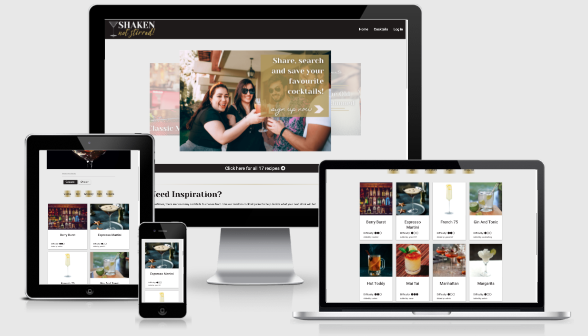

[&#x1F378;  &nbsp; **View Live Website**  &nbsp; &#x1F378;](http://shakennotstirred.herokuapp.com/)

[&#x1F379;  &nbsp; **View GitHub Repository** &nbsp; &#x1F379;](https://github.com/OliHickie/shakennotstirred)

Shaken, Not Stirred! is a website designed for users to share, discover, rate and review cocktail recipes. The website allows a user to create their own profile with which they may upload, edit and delete cocktail recipes. A user can view other user's cocktails and add a written review as well as rate the recipe. This website was created as part of my Full Stack Web Developer Diploma with Code Institute.

# Contents

1) [User Experience](#user-experience)
2) [Features](#features)
3) [Database Design](#database-design)
3) [Technologies](#technologies)
4) [Testing](#testing)
5) [Deployment](#deployment)
6) [Credits](#credits)

 

# User Experience

## User Stories

As a user of this website, I have come here to searh for new and exciting cocktails to make. I would also like to become part of a recipe sharing community where I can share some of the best recipes I used in the past. 

**As a new user (without a profile):**
I would like ot be able to:
    
- (US01) Quickly understand the purpose of the website. 
- (US02) Easily navigate around the various pages.
- (US03) Create a user profile and log in. 

**As a returning user (with a profile)**
I would like to be able to:

- (US04) Easily navigate to the login page.
- (US05) Be directed to my personal profile page.
- (US06) Add a cocktail recipe.
- (US07) Review other people's cocktail recipes.
- (US08) Be able to edit and delete my recipes.
- (US09) Be able to edit and delete my reviews.
- (US10) Be able to log out easily. 

**Shared user stories**
I would like to be able to:

- (US11) Experience intuitive navigation with quick and easy links to pages as well as return back to pages without needing to use the browser's back button. 
- (US12) Search for and find cocktail recipes.
- (US13) Have access to a quick search feature relying on the base spirit of the cocktail. 
- (US14) Read recipes and reviews left by users. 
- (US15) See an average rating for each recipe. 
- (US16) Discover a randomly chosen recipe when struggling for inspiration.
- (US17) Discover a popular recipe depending on the season. 
- (US18) Be able to contact the site owner with feedback or comments. 

**As the site owner**
I would like to be able to:

- (US19) Be able to edit and delete any cocktail recipe. 
- (US20) Be able to delete and edit any rating. 

## Design

The overall design was aimed at being sophisticated with a touch of fun. I wanted the site to appeal to both sexes and people of all ages. 

- Color Scheme

    The color scheme was chosen to be fairly simple as, inevitably, the use of imagery would brighten up the site. Therefore, I concentrated on three colors for the content of the pages; black, white and gold. Black and White were chosen to give a 'Black Tie' feel and that, along with splashes of gold, would give the site a clean and sophisticated look. I chose slightly off-black and off-white to soften the page and contrast. 

    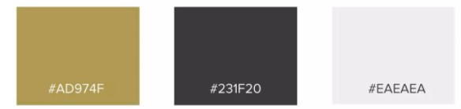

- Typography

    The two main fonts used on the site are 'Yeseva One' and 'Roboto', both of which were imported from [Google Fonts](https://fonts.google.com/).

    'Yeseva One' is reserved for larger headings (h1 - h3) and is a large, heavy font with soft edges. I wanted headings to be clear but not too strong. 'Roboto' is a clear font as is used for the website content. It is easy to read but is softened by its cursive style. I find that both fonts fit the theme of being sophisticated by generally light-hearted. 

    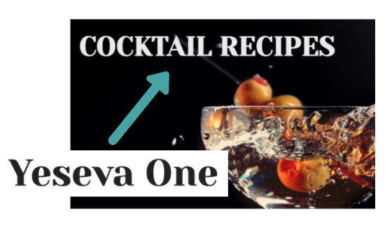
    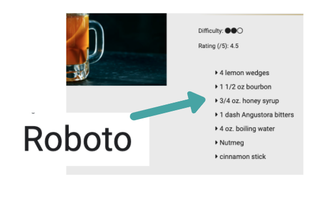

    Occassionally, a more calligraphic style font is used in some of the feature content. This is to add a welcoming feel to the home page and the logo. The fonts are not as easy to read as the main fonts, however, the added style adds a warmth and a conversational feel to the (often) subtitles in contrast to 'Yeseva One'. 

    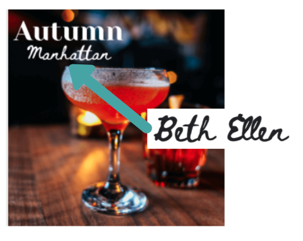

- Imagery

    Imagery is widely used on this site. The colors break up the black and white template and add a friendly and inviting feel. 
    The homepage is littered with imagery to welcome the user and help a new user understand the function of the site. There is little control over what imagery is uploaded by the user when adding a cocktail recipe. However, to ensure the image is visible, the height has been fixed and, if any inappropriate imagery is added, the admin (or site owner) is able to edit and change the image. Imagery is an important way of enticing the user into clicking a recipe. With that in mind, if no image url is added to a recipe, a default image loads instead. 

- Wireframes

    Follow the link below to view the wireframes. 

    [WIREFRAMES.md](WIREFRAMES.md)

 

# Features

- **Header**
    
    The header is available on all pages and houses a website logo (which links the user to the home page) and navigation item. On smaller screens, the navigation items are located in a collapsible menu which is accessed using a hamburger icon in the top left of the screen. 

- **Nav bar items**

    The nav bar items are listed as follows:

     

     'My Recipes' is only visible and available to users once logged in. 'Log In' replaces 'Log Out' if no user is currently logged in and both items take the user to the log in page.

- **Footer**

    The footer appears on all pages and comprises of three main componants. 
    
    1. A repitition of the logo along with a description of the purpose of the site. 
    2. A quick search feature which, when a spirit is chosen, will take the user directly to the cocktails page and display a list of cocktails containing that base spirit.
    3. A feedback link to email the site owner in case a user has any feedback or would like to report an issue. 

    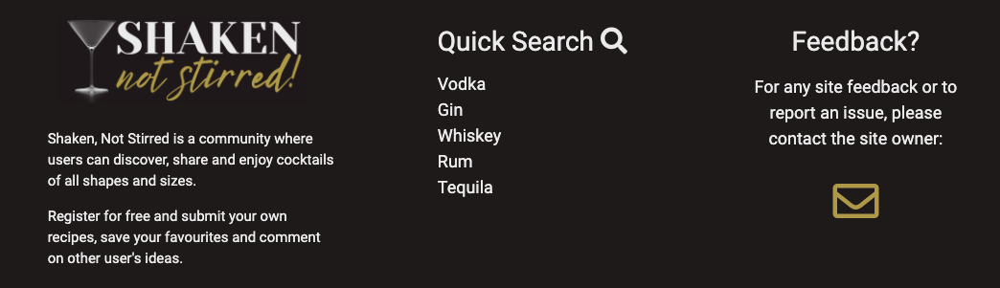

- **Home Page**

    The home page is a welcoming page designed to give the user an outlook of the whole site as well as offer some suggestions for cocktails. As a site owner, it is also designed to encourage a new user to sign up for an account. 

    The top banner consists of a carousel with three slides; the first (upon the page loading) is a slide directing the user to log in or create an account. Two further slides are suggesting favourite cocktail recipes to try. All three slides are clickable a link the user to the desired page (whether the login page or recipe page).

    Below the carousel is a wide clickable button taking the user to all the recipes available. The button also contains a counter displaying how many cocktails are currently on the database. 

    The next section is a random cocktail picker that, on each page load, will return a random recipe from the database and display it to the user. There is also a button to quickly refresh the page and display an alternative cocktail. 

    Below that is a 'Cocktail for Every Season' section, again, designed to inspire and entice a user into clicking onto a cocktail recipe and trying it out. 

    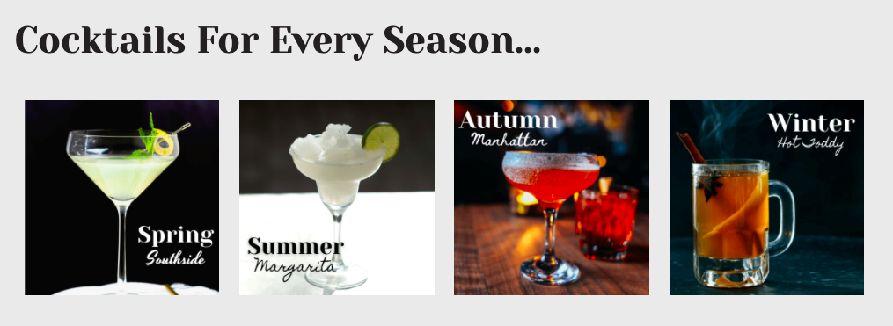

    N.B. all cocktails that appear on the home page are have been added by the site owner, so cannot be deleted or edited. 

    The final section is a brief description of what is available to a user when they sign up for the website. The three sections; create, discover and rate and review, lead to a sign up button which will take the user to a log in/register page. 

- **Log in/Register**

    The login and register functions share a page and are both accessed via a card with movable tabs. 

    The registration form is simple and requires a user to offer a username (that does not already exist in the database) which is at least 5 characters in length. They also need to submit a password twice to confirm matching data before beging logged in and directed to the "My Recipes" page. A flash message lets the user know that the registration has been successful. 
    
    It's is similar for a returning user, although the form checks to see whether the username exists and whether the password matches the stored data. 

- **Cocktails Page and Cocktail Cards**

    The cocktails page is the main page of recipes. This is available to users whether they are signed in or not. Before the list of cocktails are displayed, there is a search feature and quick search tabs. The search feature uses key words and searches the cocktail names as well as ingredients. If no cocktail is found then a message is displayed informing the user of this.

    The quick search tabs are a quick way of searching for the base alcohol in the cocktail. These are the main six spirit bases that are used and will return cocktails containing those spirits. 

    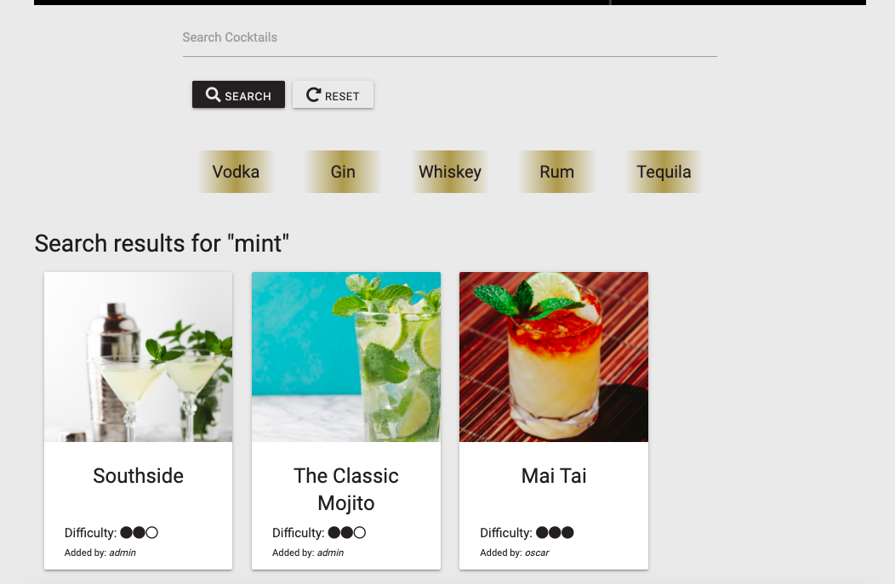
    
    We then come to the recipe cards themselves. The cards are all clickable links which take the user to the specific recipe page. The cards display four pieces of information about the cocktail:
        
    - An image of the cocktail, taken from a url provided by the recipe author. If the author hasn't provided a url (which is optional), a default image will be displayed. 
    - The name of the cocktail. This is limited to 20 characters in order to prevent any overflow. 
    - The difficulty of the recipe, which is presented as dots to portray easy, medium or difficult. 
    - and the creator of the recipe. 

    The recipe cards are designed so that overflow is not possible and reduce in number per row as the screen size reduces. The recipe cards are also paginated and have a limit of twelve cards per page to prevent the page from getting too long. 

    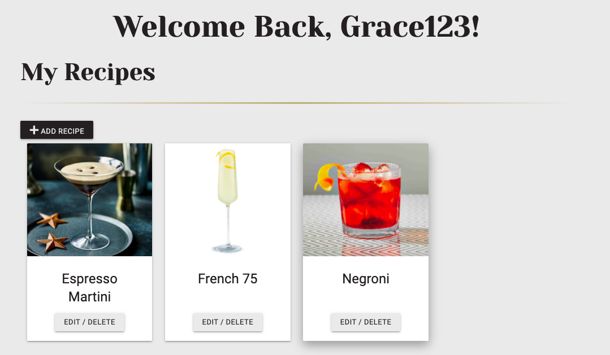

- **My Recipes**

    The "My Recipes" page is similar to the "Cocktail" page, however, this page only displays cocktails contributed by the current user. From here, the user is able to progress to an edit page allowing them to edit or delete the recipe. This page also includes a link so the user can add more of their own recipes.

    The site Admin account has acces to all cocktails on this page in order to allow edit and delete functionality across all data. 

    Before adding any cocktails, a message is displayed and the "add recipe" button is more central. 

    Below is an example of a users profile page who has added three cocktails to the site. 

    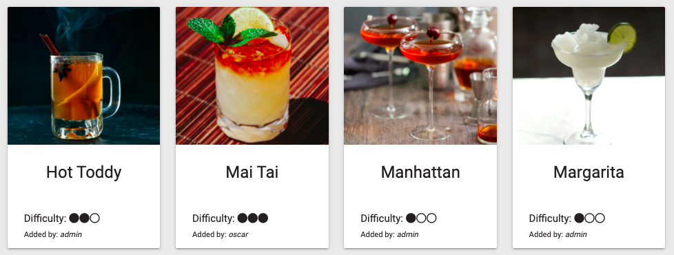

- **Add/Edit a Recipe**

    To create a new recipe, the Add Recipe button (found in "My Cocktails") will take the user to a form on a new page. This form allows for the following information to be added:

    - Cocktail Name - limited to 20 characters to avoid overflow when displayed as a card.
    - Difficulty - this is a dropdown option for easy, medum or difficult. 
    - Category - To help categorise the cocktail by it's base spirit.
    - Add ingredient/quantity -  This is where the user can add the cocktail ingredients. There is an add and a remove button to add/remove extra lines. However, the initial line cannot be deleted as at least one ingredient is required. 
    - Method - a text box to describe the method. 
    - Image URL - For the user to add a url to a cocktail image. If no image is added then, when the cocktail information is loaded, a default image will appear in it's place. There is also a tooltip next to this field to help a user find an image url. 
    - Submit and reset button. 

    This form has the same layout when the user has chosen to edit the cocktail with two additional features. 

    - The existing data already appears as the input section. 
    - A delete button - this allows the user to permanantly delete the recipe, as well as all corresponding reviews, from the database. For added security, there are several steps the user must go through, including a confirmation modal, in order to delete a recipe:
    
        My Cocktails > Edit Recipe > Delete Recipe > Confirm Modal

    Once edited/deleted, a flash message will appear at the top of the screen confirming the function has been successful. 

- **Recipe**

    The recipe page displays the the details of the cocktail including the image, name, difficulty, author, list of ingredients and the method. It also displays a rating, which is the average rating of all the reviews committed by users.

    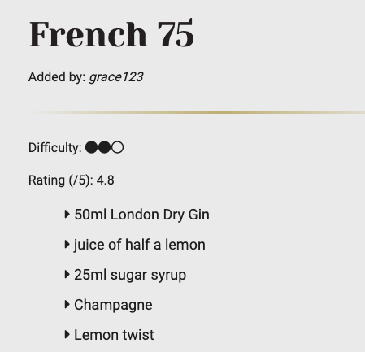
    
    Below the recipe method is the review section where users may add a rating and a comment about the cocktail. The ratings here are displayed out of 5 stars.
    There is a button to take the user to the review form which works in much the same way as the add/edit recipe function (above). 
    As demonstrated in the image below,the review can be edited and deleted (via confirmation modal for added security) by the review author or the Admin user. The review option is only available to users who are logged in, oterhwise the button will take you to the login page.  

    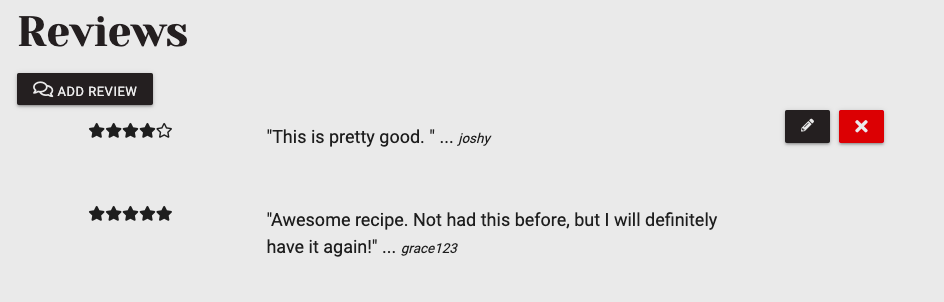

## Future Features

In due course, I would like to implement the following features:

- Users are able to add cocktails to their favourites which would be displayed on their profile page. 
- Update the contact/feedback link in the footer to become a functioning feedback form. 
- Implement Ajax so that the random cocktail selector and the search cocktail feature doesn't require a full page reload to display the results. 
- Allow users to upload images of the cocktail without relying on urls. 

 

# Database Design

MongoDB was used to store the data for this site and in three seperate collections. The layout of the data can be seen below. 

| Users |    |
|-------|-----|
|_id | ObjectId |
| username | string |
| password | string |

 

| Recipes |    |
|---|---|
| _id | ObjectId |
|cocktail_name|string|
| difficulty | string |
| category | string |
| ingredients | array |
|method | string |
| image-url | string |
| created_by | string |

 

| Reiews |    |
|---|---|
| _id | ObjectId |
|cocktail_id |ObjectId|
| comment | string |
| rating | integer |
| user | string |

 

# Technologies

- [HTML5](https://en.wikipedia.org/wiki/HTML5)
- [CSS3](https://en.wikipedia.org/wiki/CSS)
- [Python3](https://www.python.org/) 
- [Javascript](https://www.javascript.com/)
- [JQuery](https://jquery.com/)
- [Flask](https://flask.palletsprojects.com/en/2.0.x/)
- [Jinja](https://jinja.palletsprojects.com/en/3.0.x/)
- [Werkzeug](https://werkzeug.palletsprojects.com/en/2.0.x/) 
- [Materialize CSS](https://materializecss.com/) - used for front end templates, elements and styling.
- [FontAwesome](https://fontawesome.com/) - used to import icons.
- [Google Fonts](https://fonts.google.com/) - used to import fonts.
- [Balsamiq](https://balsamiq.com/) - used to build wireframes.
- [RandomKeygen](https://randomkeygen.com/) - used to generate SECRET KEY.
- [Tiny JPG](https://tinyjpg.com/) - used to compress images.
- [Git](https://git-scm.com/) - used for version control.
- [GitPod](https://gitpod.io/) - IDE used.
- [GitHub](https://github.com/) - used to house the repository.
- [Heroku](https://id.heroku.com/) - used for deploying the website.
- [Canva](https://www.canva.com/)  - used for visual designs including logo.

### Validators and Testing

- [HTML Validator](https://validator.w3.org/)
- [CSS Validator](https://jigsaw.w3.org/css-validator/)
- [PEP8 Validator](http://pep8online.com/)
- [JSHint](https://jshint.com/)
- [Lighthouse](https://developers.google.com/web/tools/lighthouse)

 

# Testing

Please for [Testing](TESTING.md) document here. 

 

# Deployment

### Deploying on Heroku

 

1.  Create a requirements.txt file by typing the following command into the terminal:

    > pip3 freeze --local > requirements.txt

2. Create a Procfile by typing the following command into the terminal:

    > echo web: python run.py > Procfile

3. Save and push the new files to your repository. 

4. Sign Up/Login into [Heorku](https://id.heroku.com/) and create a new app. Give the app a unique name.

5. Select 'GitHub' from Deployment method options and search for the repository name. Once found, click on connect.

6. Head over to the settings menu and update the _Config Vars_ to the following key, value pairs:
 

| Key  | Value    |
|---|---|
| IP | 0.0.0.0 |
|MONGO_DBNAME| _your_mongodb_name_|
| MONGO_URI | mongodb+srv://root:<_your_password_>@cluster0.sgi7e.mongodb.net/<_your_database_>?retryWrites=true&w=majority |
| PORT | 5000 |
|SECRET_KEY |_your_secret_key_|

 

7. Go to the deploy tab and click on **Deploy Branch**

### Cloning the Repository
 

To clone the site follow the following steps.

1. Log into GitHub.
2. Go to the site's [repository](https://github.com/OliHickie/shakennotstirred).
3. Next to the green 'Gitpod' button, click the dropdown arrow and copy the url. 
5. Open your terminal and type the following followed by the copied url:

    > git clone <paste_url_here>

6. Install the requirements with the following command:

    > pip3 install -r requirements.txt

 

# Credits

### Images and Content

- The majority of the admin's cocktail images, as well as the site images were taken from [Pexels](https://www.pexels.com/) and [Shutterstock](https://www.shutterstock.com/home).
- The cocktail recipes added by the admin were taken from [BBC Good Food](https://www.bbcgoodfood.com/), [Spruce Eats](https://www.thespruceeats.com/classic-cocktails-you-must-try-759886) and the [Codex Book](https://www.amazon.co.uk/Cocktail-Codex-Fundamentals-Formulas-Evolutions/dp/160774970X).
- The design and idea for the website was taken from [The Cocktail Project](https://www.thecocktailproject.com/).

### Code

- Many elements were taken from [Materialize CSS](https://materializecss.com/). Notably, the nav bar, footer, cards and forms elements. 

- The Pagination code was taken from this [article](https://betterprogramming.pub/simple-flask-pagination-example-4190b12c2e2e), this [repository](https://github.com/alandoherty95/reciprocate-app) and this [video](https://www.youtube.com/watch?v=PSWf2TjTGNY) helped too!

- Inspiration and ideas came from the Code Institute Task Manager Project. 

### Acknowledgements

I would like to thank my mentor Maranatha Illesanmi for his time and patience and for making the road ahead look clearer, and the Tutor team at Code Institute for their help and support.