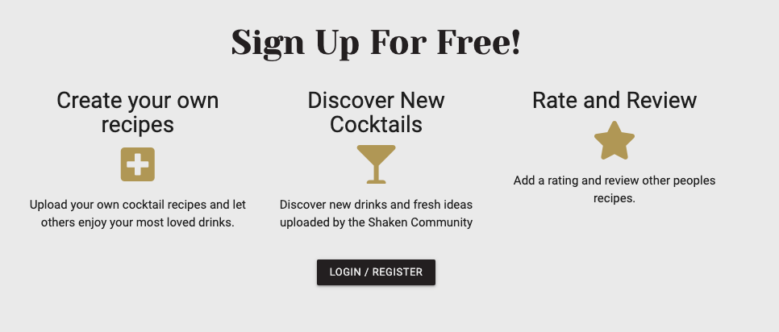
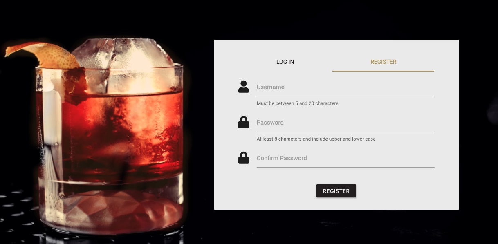

# Testing

## Functionality Testing

- Manual testing was carried out on:
    - Desktop: Apple and Dell
    - Tablets: Apple and Samsung
    - Mobile: Apple and Samsung
    - Browsers: Chrome, Safari, Edge and Internet Explorer

- During manual testing the following tests were carried out:
    - All links worked and took the user to the desired target. These links included:
        - all nav bar links (including logo)
        - carousel links (home page)
        - randomizer and other recipe links on home page
        - login button (home page)
        - all footer links including quick search tabs and email link
        - all recipe cards
        - pagination links
        - all form buttons and modals
        - login and register buttons

    - The nav bar collapsed in smaller screens and became reachable through a hamburger icon.

    - The search bar returned cocktails with keywords included. A search message confirms what the user has searched for. If no cocktail is returned, a user message is displayed. 

    

    - The quick links return cocktails which have been placed into that category. 

    - All form inputs are labelled and are validated. 

    - All data is successfully stored in the database and return flash messages to confirm with user.

    - User buttons that require you to be logged in (e.g. Add Review) take the user to the login page. 

    - Recipes are displayed in alphabetical order and are paginated with twelve recipes per page. 
    
    - All reviews are displayed with the most recent first with a new rating included and updating the recipe rating. 

- The following security measures were tested:

    - If no user is logged in, any url requiring a valid username redirect user to 404 page which includes a link back to the home page. 

    

    - Before any recipe or review can be deleted, the user must confirm deletion via a modal. 

    - All passwords are successfully scrambled when saving in the database using Werkzeug security.

## Validation

The following results were returned from validating my code. 

- **HTML** passed with one warning

- **CSS** passed.

- [JS Hint](https://jshint.com/) returned no issues.

- [PEP8](http://pep8online.com/) returned linting errors with regards to pagination. Firstly, 'variables being declared and not being used' was solved by swapping out unused variables with an underscore. Secondly, 'Possible unbalanced tuple unpacking' was solved by including '# pylint: disable=unbalanced-tuple-unpacking' before the line (as suggested here - https://stackoverflow.com/questions/27980121/pylint-warning-possible-unbalanced-tuple-unpacking-with-sequence) Neither warning affected the codes functionality. No other issues were reported.

## User feedback

Some changes were made to the site after receiving user feedback:

- Originally, 'Cocktails' was called 'Recipes' and 'My Recipes' had the title 'My Cocktails'. The wording Cocktails and Recipes was swapped to give the user a clearer idea of the function of these pages. 

- The recipe card had a button to click in order to take the user to the recipe page. Instead, this has been removed and now, the card is a clickable anchor link performing the same function. Visually, this created less clutter on the page with the removal of many buttons. 

- Reviews were listed with the newest review first. 

## Lighthouse

I used Chrome Dev Tools' Lighthouse feature to test Performance, Accessibility, Best Practices and SEO. Below are the results:

### Home Page

### Cocktails
)

    * SEO is noticeably lower on this page due to Pagination links not being crawlable. 

### My Recipes

### Login

### Recipe

### Form

    * Accessibility was lower on this page as it flagged the contrast between the form labels not being large enough. 

## Testing User Stories

- (US01) A user visiting the page for the first time will see a landing page with many links to cocktail recipes and invitations to sign up. There is an explanation for the sites goal in the footer as well as a section on what features are available to the user. 

- (US02) The pages are easy to navigate via the nav bar at the top of each page. There are clear buttons on forms to ensure the user does not need to use the browser back button. Any page errors bring a user to a 404 page with a link back to the home page.

- (US03)/(US04) A user profile can be created via the 'Log In' page needed just a username and a password. Here a returning user can log in too.

- (US05) After logging in or signing up, the user is then directed to the personal profile page. This is also available via the nav bar. 

- (US06) A user can add a cocktail via the My Recipe page. The cocktail will automatically be added to the user's personal list and to the main database for others to see. 

- (US07) When visiting a recipe page, there is a button next to the reviews for a user to add their own review. If the user is not logged in, they will be directed to the log in page. 

- (US08) Editing and deleting recipes is available from the user's profile page. The Edit form will already contain the cocktails current information, so the user simply needs to update the area they wish to edit. If deciding to delete the cocktail, a confirmation modal will pop up to check this is the option the user wishes to take. 

- (US09) Edit and delete buttons are visible next to reviews written by the user only. The edit button will take the user back to the review form and delete button will confirm via a modal.

- (US10) The log out tab replaces the log in tab in the nav bar when a user is logged in. 

- (US11) Many back buttons and extra buttons are available, as well as the nav bar, to ensure the user does not need to use the browser back button. 

- (US12) The search bar is at the top of the cocktail list which searches the name or list of ingredients of cocktails.

- (US13) The list of spirits below the search bar immediately filters the cocktails and displays cocktails in the category they have chosen. 

- (US14) Each recipe card is clickable and take the user a page dedicated to that recipe, displaying ingredients, method, rating, difficulty, as well as reviews and user ratings. 

- (US15) An average rating for each recipe is available to see on the recipe page. This can be added to within the review section. 

- (US16) A randomly chosen recipe is displayed on the home page as a feature. The user can 'pick again' by refreshing the page using the button provided. The next step will be to implement an Ajax function in order for the cocktail to refresh without the page needing to reload.

- (US17) Another feature on the home page is a selection of cocktails chosen by the site owner which go well with the season they are paired with. 

- (US18) A link in the footer will open an email pop up in order for the user to contact the site owner with any feedback and/or comments. The next step will be to include a feedback form here instead of an external link.

- (US19)/(US20) The site owner/admin account is able to edit and delete any data directly from the website. All edit and delete buttons are visible as well as all recipes appearing on the "My Recipes" page. 

